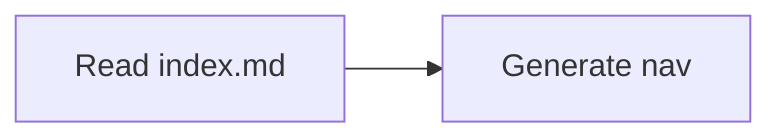

# Contributing to OAT Docs

Documentation should ship with the code it explains. This docs app is scaffolded to give contributors and agents a shared contract for navigation, Markdown features, and local tooling.

## Navigation contract

- Every documentation directory must contain an `index.md`.
- Each `index.md` must include a `## Contents` section.
- The `## Contents` section is the machine-readable local map for sibling pages and child directories.
- `overview.md` is deprecated. Replace it with `index.md` or a descriptive leaf page when the directory already has an `index.md`.

## Local workflow

1. Start the dev server from the repo root:

   ```bash
   pnpm dev:docs
   ```

2. Run Markdown linting:

   ```bash
   pnpm --filter oat-docs docs:lint
   ```

3. Run Markdown formatting:

   ```bash
   pnpm --filter oat-docs docs:format
   ```

## Supported Markdown features

### Frontmatter

Every page should have `title` and `description` fields in YAML frontmatter. The `title` is used for sidebar navigation and page headings.

### Callouts

GitHub-style callout blocks are supported:

```markdown
> [!NOTE]
> Useful supporting context.

> [!WARNING]
> Important caution for the reader.
```

### Mermaid diagrams

Fenced code blocks with `mermaid` language are rendered as diagrams:

````markdown

````

### Code blocks

Standard fenced code blocks with syntax highlighting are supported for all common languages.

## Agent guidance

- Treat `index.md` plus its `## Contents` section as the local discovery source of truth.
- Prefer linking to source files and commands explicitly when documenting behavior.
- Run `pnpm exec oat docs generate-index` to regenerate the docs surface index after adding or removing pages.
